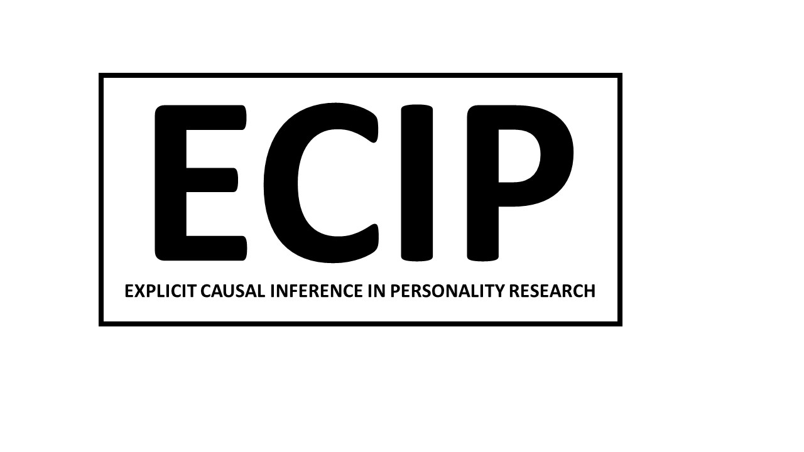

```{r setup, include=FALSE}
knitr::opts_chunk$set(echo = FALSE)

# Learn more about creating websites with Distill at:
# https://rstudio.github.io/distill/website.html

# Learn more about publishing to GitHub Pages at:
# https://rstudio.github.io/distill/publish_website.html#github-pages

```

The Explicit Causal Inference in Psychology (ECIP) network is a scientific network aiming to reduce the divergence between theories in personality psychology - which are usually concerned with causal effects and mechanisms - and empirical findings - which often do not address causal relations - by demonstrating how personality researchers can effectively integrate causality into their work. To do so, we will elaborate on, apply, and demonstrate methods for drawing causal inferences in empirical research on personality. 
  
  We will address methodological and conceptual issues surrounding causal personality research developing methodological and conceptual guidelines and tutorials. The network's outcomes will further consist of empirical research projects that explicitly investigate causal effects involving personality, as well as a pre-conference workshop for early career researchers at the European Conference on Personality ([ECP](https://www.ecp20.com)) in Madrid in July 2022.

```{r}

```

# News
(...)